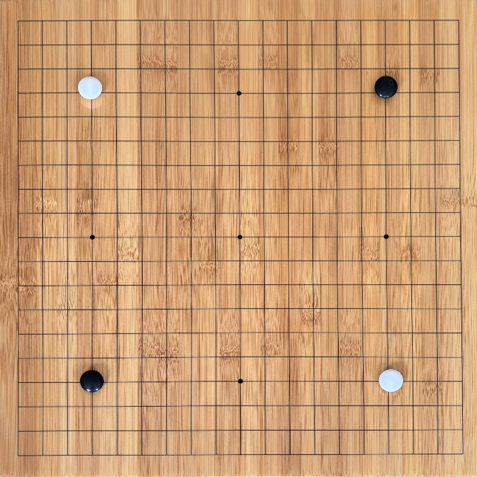
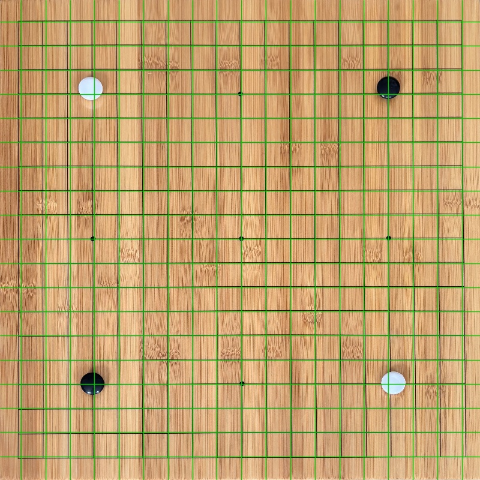

# Go Board Detection and Segmentation

Setup and run:
1. Install dependencies and set up virtual environment: `uv sync`
2. Run example .jpgs in ./images/: `uv run main.py`

Current pipeline tries to:
1. segment board and identify corners
2. transform persepctive to a flat view of the board
3. identify the 19x19 grid lines

Original image:

Board segmentation:

Transformed board:

Grid overlay:

Output images from each of those steps are stored in `./out/` by `main.py`.

Logic is still very particular to my particular board, background image, camera, etc. I'll work on generalizing the logic in the near future. Next step is adding logic for checking stone placement at grid vertices.